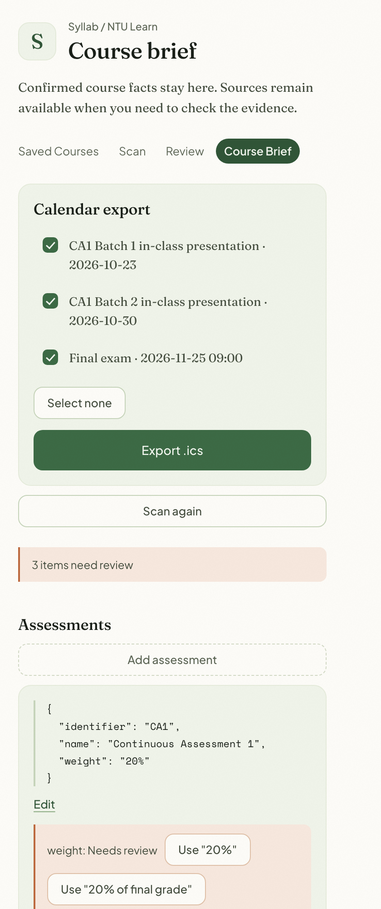
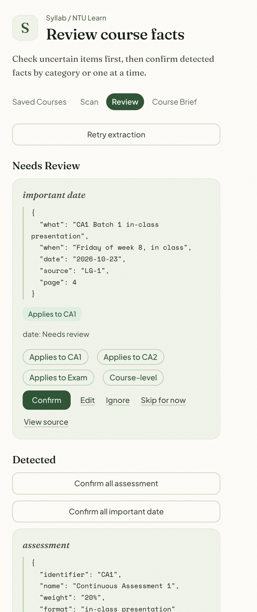

# Syllab for NTU Learn

[中文](#中文) · [English](#english)

## 中文

Syllab 是一款面向 NTU Learn（Blackboard Ultra）的 Chrome 扩展。它把散落在课程页面、公告、
作业和附件里的重要信息整理成一份可追溯来源的 Course Brief，供学生审阅、确认并导出到日历。

### 为什么做 Syllab

课程日期、考核权重、提交要求和重要规则往往分散在不同页面与文件中，既难以快速掌握，也很难在
需要时重新找到。Syllab 在 NTU Learn 之上提供一层个人信息整理能力：只在学生主动发起时扫描
课程，保留每条信息的来源证据，并要求学生确认后才写入 Course Brief。

### 核心功能

- 发现课程页面、公告、作业和支持的附件。
- 仅对扫描中实际发现的附件域名请求访问权限。
- 解析支持的课程文件并保留来源信息。
- 通过后端 AI 代理提取考核、重要日期和重要规则候选项。
- 在候选项进入 Course Brief 前进行审阅、编辑、确认、忽略或手动补充。
- 保持考核相关日期、规则与对应考核的关联。
- 中断后继续扫描，不删除已有 Course Brief。
- 重新扫描时不覆盖已确认、已编辑或用户新增的信息。
- 将已确认日期导出为 `.ics` 日历文件。
- 将课程数据保存在扩展本地。

### 产品截图

以下截图来自 v0.1.0 当前扩展界面的实际构建结果，不是设计稿或生成式示意图。

| Course Brief                                                                | Review                                                          |
| --------------------------------------------------------------------------- | --------------------------------------------------------------- |
|  |  |

### Demo / 使用方法

v0.1.0 暂无在线 Demo。Syllab 需要已登录的 NTU Learn 浏览器会话和正在运行的后端，当前可按以下
方式在本地体验：

1. 按下文说明启动后端。
2. 构建扩展，并在 Chrome 中以未打包扩展加载 `extension/dist/`。
3. 打开一个 NTU Learn 课程页面。
4. 打开 Syllab，选择 **Scan this course**。
5. 审阅提取出的候选信息，确认需要进入 Course Brief 的内容。
6. 按需导出已确认的日期。

### 当前版本

**v0.1.0 — MVP 已完成并通过最终验收（2026-09-17）。**

端到端流程已在两门真实 NTU Learn 课程上验证，覆盖附件权限 Allow / Deny、中断与恢复、后端
失败与恢复、重新扫描，以及日历导入。

当前限制：

- 开发构建默认连接 `http://127.0.0.1:8787`，尚不是托管的生产版本。
- 真实 PDF 和 ZIP 路径已完成端到端验证；真实 PPTX、DOCX、旧版 Office、超限、无文本和损坏
  文件样本仍为 **NOT TESTED**。
- 仍有两个影响用户的问题：部分已确认日期可能在日历导出时被静默遗漏；进入 Review 前使用
  `Retry extraction` 可能重复产生一次付费提取。

本版本的最终交付范围、验证证据、已知风险和 Carry Over 见
[PRODUCT_HANDOFF_v0.1.0.md](Syllab_MVP_Delivery_v0.1.0/PRODUCT_HANDOFF_v0.1.0.md)，详细验收记录见
[docs/final-acceptance-v0.1.0.md](docs/final-acceptance-v0.1.0.md)。

### 技术栈

- Chrome Manifest V3 扩展
- TypeScript 与 esbuild
- Chrome storage / 基于 IndexedDB 的本地状态
- PDF.js、`fast-xml-parser` 与 `fflate` 文档处理
- 轻量 Node.js AI 代理，负责 DeepSeek 访问、鉴权和用量保护
- Vitest、ESLint 与 Prettier
- 扩展与后端共享的版本化 API contracts

DeepSeek API Key 仅存在于后端运行环境，不会打包进扩展或提交到仓库。

### 本地运行

环境要求：Node.js 22 或更高版本、npm、Chrome 120 或更高版本、NTU Learn 访问权限，以及由你
自己的本地环境提供的 DeepSeek API Key。

安装依赖并创建本地环境文件：

```bash
npm install
cp .env.example .env
```

在被 Git 忽略的 `.env` 文件中设置 `DEEPSEEK_API_KEY`。不要提交该值，也不要把它粘贴到 Issue、
日志或聊天记录中。

构建并运行完整检查：

```bash
npm run ci
```

在一个终端中启动后端：

```bash
set -a
source .env
set +a
npm run start -w @syllab/backend
```

本地后端默认监听 `http://127.0.0.1:8787`。

加载扩展：

1. 打开 `chrome://extensions`。
2. 启用 **Developer mode**。
3. 选择 **Load unpacked**。
4. 选择 `extension/dist/`。
5. 使用扩展前，打开或刷新 NTU Learn 课程标签页。

每次重新构建或重新加载扩展后，都要刷新所有已经打开的 NTU Learn 标签页，否则旧标签页中的
content script 会失效，弹窗可能无法识别课程上下文。

如需在构建时指定其他后端：

```bash
SYLLAB_BACKEND_URL=https://your-backend.example npm run build -w @syllab/extension
```

### 项目状态

v0.1.0 是已完成并验收的功能 MVP，但还不是生产部署版本。产品设计发现与工程 Carry Over 已被
明确记录，没有被静默写回已验收基线。后续版本应从新的 PRD 和明确的产品决定开始。

### License / Contribution

项目目前尚未发布开源许可证或公开贡献流程。在此之前，请勿默认拥有再分发或复用权。项目开放给
外部贡献者时，可再补充贡献指南。

---

## English

Syllab is a Chrome extension for NTU Learn (Blackboard Ultra). It turns important information
scattered across course pages, announcements, assignments and attachments into a source-backed
Course Brief that students can review, confirm and export to their calendar.

### Why Syllab

Course dates, assessment weights, submission requirements and important rules are often spread
across different pages and files. They are difficult to understand at a glance and hard to find
again. Syllab adds a personal organization layer to NTU Learn: it scans only when the student asks,
keeps source evidence, and requires confirmation before information enters the Course Brief.

### Core features

- Discover course pages, announcements, assignments and supported attachments.
- Request access only to attachment hosts actually discovered during a scan.
- Parse supported course documents and retain source provenance.
- Extract candidate assessments, important dates and important rules through a backend AI proxy.
- Review, edit, confirm, ignore or add course facts before they enter the Course Brief.
- Keep assessment-specific dates and rules attached to their assessment.
- Resume interrupted scans without deleting an existing Course Brief.
- Run Scan again without overwriting confirmed, edited or user-added facts.
- Export confirmed dates as an `.ics` calendar file.
- Store course data locally in the extension.

### Product screenshots

These screenshots come from the current v0.1.0 extension build. They are not design mockups or
generated illustrations.

| Course Brief                                                              | Review                                                             |
| ------------------------------------------------------------------------- | ------------------------------------------------------------------ |
|  |  |

### Demo / usage

There is no hosted public demo in v0.1.0. Syllab needs an authenticated NTU Learn browser session
and a running backend. The current local demo path is:

1. Start the backend as described below.
2. Build and load `extension/dist/` as an unpacked Chrome extension.
3. Open an NTU Learn course page.
4. Open Syllab and choose **Scan this course**.
5. Review the extracted candidates and confirm the facts that should enter the Course Brief.
6. Export selected confirmed dates when needed.

### Current version

**v0.1.0 — MVP implementation complete and final acceptance passed on 2026-09-17.**

The end-to-end path has been validated on two real NTU Learn courses, including attachment
permission Allow / Deny, interruption and recovery, backend failure and recovery, Scan again, and
calendar import.

Current limitations:

- The development build points to `http://127.0.0.1:8787` by default; it is not a hosted production
  release.
- Real PDF and ZIP paths passed end to end. Real PPTX, DOCX, legacy Office, oversize, no-text and
  corrupt-file samples remain explicitly **NOT TESTED**.
- Two user-impacting issues remain: some confirmed dates can be silently omitted from Calendar
  export, and `Retry extraction` can repeat a paid extraction before Review begins.

For the final delivered scope, evidence, known risks and carry-over, see
[PRODUCT_HANDOFF_v0.1.0.md](Syllab_MVP_Delivery_v0.1.0/PRODUCT_HANDOFF_v0.1.0.md). The detailed
acceptance record is in [docs/final-acceptance-v0.1.0.md](docs/final-acceptance-v0.1.0.md).

### Technology

- Chrome Manifest V3 extension
- TypeScript and esbuild
- Chrome storage / IndexedDB-backed local state
- PDF.js, `fast-xml-parser` and `fflate` for document processing
- Lightweight Node.js AI proxy for DeepSeek access, authentication and usage protection
- Vitest, ESLint and Prettier
- Shared versioned API contracts between the extension and backend

The DeepSeek API key exists only in the backend environment. It is never bundled into the extension
or committed to the repository.

### Run locally

Requirements: Node.js 22 or newer, npm, Chrome 120 or newer, access to NTU Learn, and a DeepSeek API
key supplied through your own local environment.

Install dependencies and create a local environment file:

```bash
npm install
cp .env.example .env
```

Set `DEEPSEEK_API_KEY` inside the ignored local `.env` file. Never commit the value or paste it into
issues, logs or chat transcripts.

Build and run the complete check suite:

```bash
npm run ci
```

Start the backend in one terminal:

```bash
set -a
source .env
set +a
npm run start -w @syllab/backend
```

The local backend listens on `http://127.0.0.1:8787` by default.

Load the extension:

1. Open `chrome://extensions`.
2. Enable **Developer mode**.
3. Choose **Load unpacked**.
4. Select `extension/dist/`.
5. Open or refresh an NTU Learn course tab before using the popup.

After rebuilding or reloading the extension, refresh every already-open NTU Learn tab. Existing
tabs otherwise keep a dead content script and the popup may lose its course context.

To target another backend at build time:

```bash
SYLLAB_BACKEND_URL=https://your-backend.example npm run build -w @syllab/extension
```

### Project status

v0.1.0 is a completed and accepted functional MVP, not a production deployment. Product design
findings and engineering carry-over are documented rather than silently folded into the accepted
baseline. Work on a later version should begin from a new PRD and explicit product decisions.

### License / contributions

No open-source license or public contribution process has been published yet. Until that changes,
do not assume redistribution or reuse rights. Contribution guidelines can be added when the project
is opened to external contributors.
