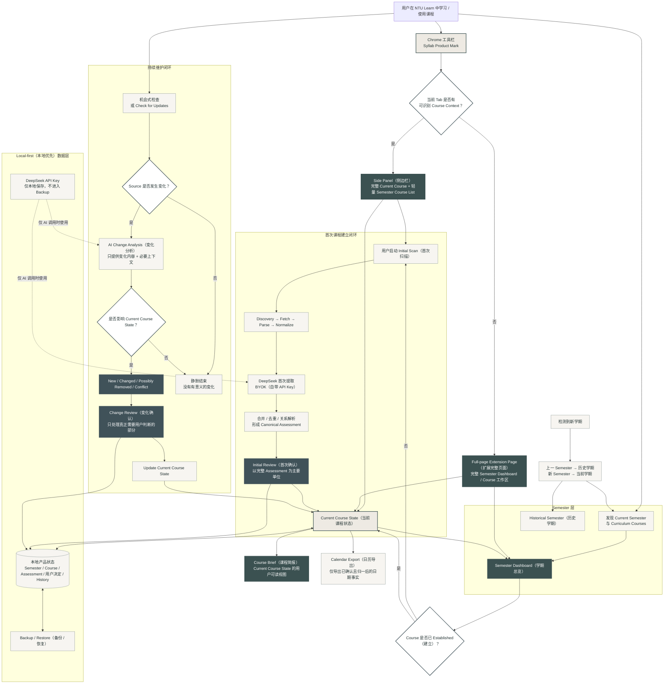

# Syllab for NTU Learn PRD v0.2.0

**产品版本：** v0.2.0  
**文档状态：** Final Integrated PRD · Engineering Freeze / Final Acceptance baseline  
**版本定位：** v0.2.0 仍属于个人产品验证阶段，不是正式生产发布版本。  
**语言规范：** 说明性内容以中文为主；产品实际使用的模块名、对象名、状态名，以及必要的行业缩写和技术标识保留英文。

> **Final-integration note (2026-09-21):** 本文已整合 Product Owner 在开工后批准的产品定义。
> 历史顺序、被覆盖的旧决定与调试事实不在 PRD 中伪装成“从一开始就如此”；
> 它们保留在 `DECISION_LOG_v0.2.0.md`、`ENGINEERING_REPORT_v0.2.0.md` 与
> `PRD_TO_ENGINEERING_FREEZE_DECISION_DELTA_v0.2.0.md`。

---

# 1. 背景与现状

NTU Learn / Blackboard 承载课程页面、Announcements（公告）、Assignments（作业）和课程附件，但信息天然按“来源”组织，而不是按学生真正关心的“这门课到底有哪些事情要完成”组织。

Syllab 不是 Blackboard 的复制品。它是在 NTU Learn 之上的个人课程信息整理与维护层：

> **读取 → 理解 → 整理 → 用户确认 → 持续维护**

v0.1.0 已验证基础链路：

> Current Course Detection → Discovery → Fetch → Parse → Normalize → DeepSeek Extraction → Review → Course Brief → Calendar Export

v0.1.0 已证明真实 NTU Learn 内容获取、AI 提取、用户确认、Course Brief 持久化与基础 Calendar Export 可行，但产品仍主要围绕“第一次建立课程”的 Scan → Review → Brief 设计。

v0.2.0 要完成的不是简单加功能，而是把产品推进为：

> **围绕一个 Semester（学期）持续维护 Course State（课程状态）的个人课程信息工具。**

## 1.1 产品全链路框架图（Mermaid）

下图将 v0.2.0 的产品载体、首次课程建立、持续更新、Semester 生命周期、AI 使用与本地数据层放在同一条链路中。它用于表达**产品逻辑与用户闭环**，不是 Technical Design（技术设计）或代码模块图。

### 图的阅读方式

- **上半部分**是用户真正接触的产品载体与 Semester / Course 入口。
- **左侧首次建立闭环**解决“第一次把一门 Course 整理出来”。
- **右侧持续维护闭环**解决“整理出来以后如何一直保持可信和最新”。
- **Current Course State（当前课程状态）**是整个产品的中心；Course Brief、Semester Dashboard 和 Calendar Export 都只是它的不同产品视图或输出。
- **Local-first 数据层**长期保存用户课程状态；DeepSeek 只参与需要语义理解的新信息处理。
- **Review 不是每次检查必经步骤**：无 Source Change 或没有有意义的变化时均静默结束。

---

# 2. v0.1.0 暴露的问题与未解决缺口

## 2.1 真实使用暴露的问题

### 2.1.1 Review 与信息整理问题

- Review 颗粒度过碎，内部 Candidate（候选事实）泄漏为用户工作单位。
- Assessment 身份碎片化，同一真实 Assessment 因不同来源、别名或表达被拆成多个对象。
- Review 承担过多系统本应完成的去重、别名、归属关系、Parent relationship 等整理工作。
- Review 纠错闭环不完整：字段错误、误识别、Merge / Split、漏掉整个 Assessment 均缺少完整处理。

### 2.1.2 Course Brief 与信息表达问题

- Course Brief 直接暴露 Raw JSON；Edit / Add 也要求用户理解 JSON。
- Brief 信息架构不可读：重复归属关系、日期混排、Assessment-specific information 被拆散。
- Brief 仍偏信息分类中心，而非用户事项中心。
- Important Rules 边界过宽，容易成为杂项桶。
- 同一现实 Deadline 可能因多来源 Evidence 生成多个 Calendar Event。
- Calendar、Scan、Review 等辅助流程过度占据 Course Brief。
- Review 未完成时，对已经确认的信息干扰过强。

### 2.1.3 Scan、导航与产品载体问题

- 状态栏看起来像导航，但实际不是可导航页面。
- Active Scan / 检查点可能阻碍用户返回已有 Brief。
- `Scan in progress` 等状态无法准确区分 Working / Waiting。
- Initial Scan 暴露过多技术阶段和 Continue / Retry / Resume 等操作。
- Popup 不适合承载长期 Scan / Review / Course browsing。

### 2.1.4 产品识别问题

- 产品缺少稳定 Product Mark（产品标识）。

## 2.2 MVP 尚未解决的完整闭环缺口

### 2.2.1 持续维护闭环

- Course Brief 仍更像一次 Scan Result，而不是持续维护的 Current Course State（当前课程状态）。
- 用户仍需自己记得何时重新检查课程。
- Scan again 尚未形成正式 Change Detection（变化检测）。
- 缺少 New / Changed / Possibly Removed / Conflict / 没有有意义的变化的稳定语义。
- 读取失败、真实变化、冲突之间的可信边界尚未建立。
- 用户历史决策没有系统进入后续维护逻辑。
- 信息新鲜度不透明。
- 持续更新失败缺少静默重试与长期提示策略。

### 2.2.2 Semester 级使用

- 缺少真正的 Semester Dashboard（学期总览）。
- 未系统利用 Blackboard Semester → Curriculum Course 结构。
- 缺少 Current / Historical Semester 生命周期。

### 2.2.3 Local-first 长期使用

- Local-first 数据缺少完整 Backup / Restore（备份 / 恢复）。
- localhost Backend 增加 BYOK 个人使用摩擦。

## 2.3 已确认用户影响缺陷

- **KR-07：** Calendar 可能静默漏掉 confirmed date。
- **KR-08：** 成功 Extraction 后仍可能出现 Retry Extraction，导致重复付费调用与候选重算。
- **E3：** Blackboard Internal Course ID 可能泄漏到用户可见课程名或 `.ics` 文件名。

## 2.4 后续保留，但不自动成为 v0.2.0 核心范围

- E4：Service Worker stale-snapshot overwrite 风险。
- E5：Storage schema mismatch recovery 风险。
- 真实 PPTX / DOCX、旧版 Office 文件、超大文件、无文本文件、损坏文件、真实独立 Parsing Failed 场景：当前属于未验证 / 证据缺口，不是已确认产品缺陷。

---

# 3. 用户需求

## 3.1 课程理解与首次建立

用户需要：

- 快速知道一门课有哪些主要 Assessment、权重、日期 / Deadline、形式和直接要求。
- 按“事项”而不是 Candidate / Date / Rule 分类理解课程。
- Initial Review（首次确认）围绕少量完整 Assessment 展开。
- 只处理系统真正无法替代的判断，不反复处理重复项、别名、明显归属关系、未变化事实。
- 通过 Edit、Exclude、Merge / Split、Manual Add 完成低负担纠错。

## 3.2 日常查看与纠错

用户需要：

- Course Brief 首先展示 Current Course State，而不是 Workflow。
- Review 未完成时，已确认内容仍然立即可用。
- Exclude、Keep Current、Manual Edit 等用户决定以真实语义延续。
- 通过 Edited / Changed 等轻量标记和背景 History / Diff 理解当前值来源。

## 3.3 持续更新与可信度

用户需要：

- Course 建立后持续保持最新，不依赖用户记得重新 Scan。
- 只在真正影响 Course State 时收到打扰。
- Change Review 只处理真正变化的部分。
- 能判断 Course 最近是否被可靠检查过。

## 3.4 Semester 级使用

用户需要：

- 从 Semester 视角统一管理所有 Curriculum Courses。
- Current / Historical Semester 自然分离。

## 3.5 数据与 AI 控制

用户需要：

- 长期 Course State 属于用户本地，AI / 网络不可用时仍可读。
- 本地数据可迁移、可恢复。
- BYOK（Bring Your Own Key，自带 API Key）成本由用户掌控。
- 复杂技术过程尽量留在后台，只在真正需要决策时打断。

---

# 4. v0.2.0 产品目标

## 4.1 总目标

> **将 Syllab 从“能够生成 Course Brief 的单课程 Formal MVP”，推进为“能够围绕一个 Semester 持续维护课程状态的完整个人课程信息工具”。**

完成三项核心转变：

- **候选事实中心（Candidate-centric） → Assessment 中心（Assessment-centric）**
- **一次扫描（One-time Scan） → 持续课程状态（Continuous Course State）**
- **单课程（Single Course） → Semester 级产品（Semester-level Product）**

## 4.2 具体目标

1. 建立 Semester → Course → Assessment → Fields / Requirements 核心模型，并保留极窄的 Course-wide Constraint（课程级约束）。
2. 将 Course Brief 升级为可信、用户可读的 Current Course State 视图。
3. 建立完整 Change Detection 与持续维护闭环。
4. 建立 Semester Dashboard 与 Current / Historical Semester 生命周期。
5. 降低长期使用成本：少打扰、Local-first、BYOK、Backup / Restore、Existing data offline-readable。

## 4.3 非目标

v0.2.0 不以 Blackboard 的复制品、Todo / Planner / Reminder Center、AI 优先级排序、Calendar Sync、Teaching Schedule、完整 History 产品、中文界面、Cloud Sync、商业化或正式生产发布为目标。

---

# 5. 产品需求与产品方案

## 5.1 核心课程模型与课程发现

### 5.1.1 核心结构

> **Semester → Course → Current Course State → Assessment → Fields / Requirements**

不再将 Date / Rule / Candidate 作为与 Assessment 平级的主要用户对象。

### 5.1.2 Canonical Assessment（规范化 Assessment）

同一真实 Assessment 即使来自不同 Source、名称不同，也应尽量归并为同一长期对象。

身份判断只产生：

- Same Assessment（同一 Assessment）
- Different Assessment（不同 Assessment）
- Uncertain（不确定）

### 5.1.3 Course-wide Constraint

仅在同时满足以下条件时成立：

- 跨多个 Assessment 或整门 Course 生效；
- 直接改变完成、提交、评价或通过方式。

### 5.1.4 Assessment Series

对于学生天然理解为同一机制的一组重复小型 Assessment，例如 `6 quizzes, best 4 count`，可形成 Assessment Series，而不是制造六个最高层平级对象。

### 5.1.5 Semester / Course 自动发现

继承 Blackboard Semester → Curriculum Course 结构：

- Curriculum Courses 自动进入当前 Semester。
- Non-curriculum 默认排除。
- Auto-discovery ≠ Auto-scan。

## 5.2 Initial Scan、课程整理与 Initial Review

### 5.2.1 Initial Scan 一次启动、自动完成

用户第一次建立课程只需明确启动一次。

内部 Discovery / Fetch / Parse / Normalize / AI Extraction / Canonicalization 自动推进，不要求用户逐阶段手动继续。

### 5.2.2 只在真正需要用户时暂停

仅在：

- 浏览器必须要求的权限；
- 必要 AI / 内容发送授权；
- Initial Review；
- 不可恢复失败；

时打断。

关闭 Side Panel（侧边栏）不等于 Cancel。

### 5.2.3 Candidate 不直接进入用户 Review

正式链路：

> Source → AI Candidate → Merge / Deduplicate → Relationship Resolution → Canonical Assessment Formation → Initial Review

### 5.2.4 Assessment-level Initial Review

用户主要操作：

- Confirm（确认）
- Edit → Confirm（编辑后确认）
- Exclude（排除）
- Merge（合并）
- Split（拆分）
- Defer（暂缓）

Merge / Split 属于低频纠错能力。

### 5.2.5 Exclude

用于 错误识别。Evidence 未实质变化时，同一错误识别不应跨 Scan 重复出现。

### 5.2.6 Manual Add Assessment

作为漏项兜底，不是主输入方式。未来 Source 检测到同一 Assessment 时应尝试 Match，而不是制造重复对象。

### 5.2.7 Review 未完成不阻塞 Brief

已确认 Assessment 可以立即进入 Current Course State。

## 5.3 Course Brief 与 Current Course State

### 5.3.1 Course Brief 的正式定义

Course Brief 是：

> **Current Course State 的用户可读 View（视图）**

而不是某次 Scan 的输出结果。

### 5.3.2 禁止 Raw JSON 作为正常产品表达

结构化机器数据必须转成用户可读字段。

用户 Edit / Manual Add 同样不得要求理解或输入 JSON。

### 5.3.3 Assessment-centric 信息架构

Assessment-specific Date / Deadline / Requirement 直接归入对应 Assessment。

归属关系 通过结构表达，不重复展示大量 `Applies to...`。

### 5.3.4 现实事件语义聚合

多个 Source 可以支持一个 Deadline，但只能形成一个 Current State 事实和一个 Calendar Event。

### 5.3.5 Brief 以事实为主体

Scan、Review、Calendar、System Status 均退居辅助位置。

### 5.3.6 Current State 轻量标记

允许：

- Edited（用户编辑）
- Changed（后续变化形成当前值）
- Possibly Removed（用户选择保留但最新可靠 Evidence 中暂时找不到）

不长期显示 Confirmed / Detected / New / User-added。

### 5.3.7 Source / Evidence

Evidence 默认不前置，但用户需要时可追溯。

### 5.3.8 Calendar

Calendar 是 Current Course State 的辅助输出，不建立独立事实模型。

用户选择 Keep 的 `Possibly Removed` 对象仍属于 Current Course State；其中满足 Calendar 导出条件的 confirmed date 继续参与 Calendar Export，直到用户明确 Remove 或 Current Course State 发生其他有效更新。

### 5.3.9 Rebuild Course

Rebuild 是低频恢复能力。它重新执行课程建立所需的扫描与整理链路，但在新结果完成前保持原 Current Course State 不变。完成后先展示完整的 Proposed Rebuilt State / rebuilt Course Brief，用户只在整体层面选择采用 rebuilt state 或保留 current state；不先清空旧 Brief。

## 5.4 持续更新与 Change Detection

### 5.4.1 核心变化语义

已建立 Course 的维护以：

> **Current Course State + New Evidence**

为基础。

正式变化类型：

- New（新增）
- Changed（已变更）
- Possibly Removed（可能已移除）
- Conflict（冲突）

### 5.4.2 Changed

只有在足够 Evidence 表明旧值已被新值替代时形成 Changed。

优先 Field-level Review。

### 5.4.3 Possibly Removed

只有相关 Source 成功检查后才能产生。Fetch / Parse / Permission failure 不得解释为 removal。

### 5.4.4 Conflict

多个 Evidence 给出竞争值、系统不能可靠判断 precedence（优先关系）时进入 Conflict。

Current State 保留现有值，直到用户解决。

### 5.4.5 Exclude 与 Reject Change 分离

- Exclude 错误识别：证据不变时持续抑制。
- Keep Current against real 来源差异：未来差异持续时仍可重新提醒。

### 5.4.6 Pending Change 始终表示最新决策

例如当前值为 10 Oct，待确认值为 15 Oct，之后来源又更新为 18 Oct，则 Review 只显示 10 → 18，15 Oct 留在 History / Diff 中。

### 5.4.7 Opportunity-based Checking（机会式检查）

用户正常使用 NTU Learn 时，Syllab 可以以合理频率检查当前 Semester 已 Established 的 Courses。

这不是 24/7 monitoring，也不是每次打开页面都全量重扫。

### 5.4.8 先判断来源是否变化，再决定是否调用 AI

- Source 未变化 → 不调用 AI。
- Source 变化 → AI 判断是否影响 Course State。
- 无 有意义的变化 → 静默结束。

### 5.4.9 Failure / 信息新鲜度

单次后台失败默认静默重试；长期 / 重复无法成功检查时才提供轻量 信息新鲜度 提示。已有 Course Brief 始终可用。

## 5.5 Semester Dashboard 与生命周期

### 5.5.1 Semester Dashboard

至少展示：

- Current Semester；
- Curriculum Courses；
- Established / Not Established；
- 主要 Assessment 摘要；
- Pending Review / Change cue。

### 5.5.2 Dashboard 不建立第二套数据模型

Dashboard 只是同一 Course State 的跨 Course 聚合 View。

### 5.5.3 Change Review 保持 Course Context

Dashboard 只提示哪门 Course 有 pending change，真正 Review 在对应 Course 内完成。

### 5.5.4 Current / Historical Semester

新 Semester 成为 Current；旧 Semester 自动进入 Historical，不要求逐门 Archive。

## 5.6 产品载体、导航与任务状态

### 5.6.1 Side Panel

承担当前 Course 上下文中的：

- 完整 Course Brief / Current Course State；
- Initial Scan；
- Initial Review；
- Change Review；
- Task Status；
- 当前 Semester 的轻量 Course List，用于在 Semester 内快速切换 Course。

Side Panel 的 Semester 视图只承担 Course navigation，不复制 Full-page Semester Dashboard 的 Assessment preview 与完整管理信息。

### 5.6.2 Full-page Extension Page

承担：

- 完整 Semester Dashboard；
- 完整 Course Brief；
- Current / Historical Semester 浏览与切换；
- Settings，包括 BYOK、Authorization、Backup / Restore；
- 更完整的课程浏览与管理。

Side Panel 与 Full-page 读取同一 Current Course State，不建立两套 Course Brief 或两套 Course 数据。

### 5.6.3 Popup 正式移除与 Toolbar Entry

v0.2.0 完全取消 Popup 产品形态。

Toolbar icon 仅作为产品入口，不打开旧式 Popup：

- 当前 Tab 存在可识别的 NTU Learn Current Course Context 时，打开 Side Panel 并进入该 Course；
- 当前没有明确 Course Context 时，打开 Full-page Extension Page 并进入 Current Semester Dashboard。

### 5.6.4 导航 与 流程状态 分离

导航 必须真正可导航；Task Status 不再伪装成页面导航。

### 5.6.5 Working / Waiting / Saved / Failed

用户应能理解系统是在：

- 工作；
- 等待用户；
- 已保存可恢复状态；
- 真正失败。

`Saved` 主要表示 persistence / recoverability，不要求作为长期常驻视觉状态。Scan、Review 或其他可恢复任务应自动保存真实进度；用户重新进入时恢复原界面与任务上下文。

### 5.6.6 已有 Course Brief 始终可达

任何 Active Scan / Check / Recoverable Task / Rebuild 都不能封锁已有可信 Brief。

## 5.7 Local-first、数据与 AI 使用方式

### 5.7.1 Local-first + BYOK

长期课程数据本地保存，用户使用自己的 DeepSeek API Key。普通使用不要求长期运行 localhost Backend。

### 5.7.2 已有数据离线可读

AI / 网络不可用时，已有 Semester / Course / Brief 仍可查看。

### 5.7.3 Backup / Restore

支持完整 Syllab state 的导出和恢复。

包括：

- Semester
- Course
- Assessment
- Course-wide Constraint
- Manual Edit / Add
- Review Decision
- Exclusion Memory
- Current marks
- History / Diff
- 必要 Source relationship

不包括：

- API Key
- Temporary Cache
- Runtime State

v0.2.0 的 Restore 采用 **Full Replace**：Backup 完整验证并经用户确认后，以 Backup state 整体替换当前本地 Syllab state。当前版本不支持 Restore Merge；Merge Restore 仅作为后续产品机会保留。Restore 失败或验证失败不得留下半恢复状态，也不得破坏恢复前的有效 state。

### 5.7.4 Privacy Authorization 与 API Usage Authorization 分离

允许课程内容发送给 AI，不等于允许无限后台消费用户 API。

### 5.7.5 不建设复杂 Cost Dashboard

避免明显重复调用即可。

### 5.7.6 i18n-ready，但 v0.2.0 仅 English UI

产品实现必须为未来 Localization 做基础准备，当前正式 UI 仍为英文。

## 5.8 AI 行为设计、基础修复与产品完整性

### 5.8.1 AI 行为属于 Product Design

AI 直接决定：

- 什么构成 Assessment；
- Requirement 属于哪个 Assessment；
- 不同 Source 是否指向 Same Assessment；
- Assessment / Component / Assessment Series 的结构；
- 新 Evidence 是 New、Changed、Conflict、Possibly Removed，还是没有有意义的变化；
- 哪些问题需要进入用户 Review。

因此开发 Agent 不得自行重新定义这些语义。

### 5.8.2 三层能力边界

AI 相关行为采用：

> **Deterministic Local Logic → AI Semantic Judgment → User Final Decision**

**Deterministic Local Logic** 只负责机器可以直接确定的事实与已知状态，例如请求成功 / 失败、文件是否存在、Parser 是否成功、机器表示是否相同、已存 ID、已知用户决定、哪些 Source 成功 Fetch / Parse / 进入 AI、持久化与 Workflow routing。

本地逻辑不得把以下弱信号直接升级为产品结论：

- Name similarity → Same Assessment
- Equal Weight → Same Assessment
- Newer timestamp → Newer truth
- Missing text → Possibly Removed
- Keyword hit → Assessment

原则：

> **本地负责管理已知关系；AI 负责发现未知语义关系。**

**AI Semantic Judgment** 负责需要课程语义理解的判断。

**User Final Decision** 负责 AI 仍无法可靠确定、或产品规则要求保护可信 Current Course State 的情况。

### 5.8.3 三个 AI Task

#### Task A — Initial Extraction / Source-level Course Understanding

回答：

> **这个 Source 在说什么？**

负责单 Source 内：

- Assessment Draft；
- Assessment Fields / Requirements；
- Course-wide Constraint Candidate；
- Source-local uncertainty；
- Evidence；
- `NO_RELEVANT_INFORMATION`。

Task A 不做跨 Source Identity，也不做 Current Course State Change Analysis。

#### Task B — Identity & Canonicalization

回答：

> **这些 Draft 指向哪些真实 Course 对象，它们之间是什么关系？**

负责：

- Same Assessment / Different Assessment / Uncertain；
- Canonical Assessment；
- Component；
- Assessment Series；
- Requirement ownership；
- 跨 Source 字段整理；
- Course-wide Constraint Candidate 的跨 Source 整理。

Assessment identity 以 **Course 中的身份 / 角色连续性**为核心。单一弱信号不能决定 Same；多个独立、相互补强、且缺少有意义反向 Evidence 的信号可以共同支持 Same。不得使用固定分数、阈值或机械打分。

#### Task C — Change Analysis

回答：

> **新的 Evidence 对已有 Current Course State 意味着什么？**

正式输出语义：

- `NO_MEANINGFUL_CHANGE`
- `NEW`
- `CHANGED`
- `CONFLICT`
- `POSSIBLY_REMOVED`
- `IDENTITY_UNCERTAIN`

Task C 默认继承 Task B 已可靠形成的 Identity 结果，不因普通 wording difference 重新做完整 Identity Resolution。只有新的实质性反向 Evidence 才可重新暴露 Identity uncertainty。

### 5.8.4 最小充分上下文

Context 原则：

> **最小充分上下文（minimum sufficient context）**

不是为了省 Token 尽量少给，也不是因为 Token 便宜就把整门 Course / 全部 History 全塞给模型。

- Task A：一个 Source + 必要 Course baseline + Source content / structure / image。
- Task B：新 Draft / Constraint Candidate + 完整当前 Course canonical object index 的精简结构 + 必要 original Evidence。
- Task C：目标对象 + current value / Evidence + new Evidence + Task B identity + 必要 user decision / related History / Coverage Facts。
- 下游 Task 不无限继承上游全部 Context。
- 关键判断必须能回到 original Evidence，而不能只依赖上游 AI summary。

### 5.8.5 Evidence 与 Uncertainty

`Source` 是完整信息来源；`Evidence` 是 Source 中支持具体判断的原始局部依据。

要求：

- 关键字段尽量保留 field-level Evidence；
- 一个事实可以有多个 Evidence；
- AI 可以解释 Evidence，但不能创造 Evidence；
- visual Source 必须可追溯到 page / visual location；
- Evidence 默认退居产品后台，需要时再查看。

不使用 numeric confidence 作为产品决策基础。

区分：

- `Known`
- `Explicitly Unknown`（如 TBD / TBC）
- `Not Mentioned`
- `Uncertain / Ambiguous`

Uncertainty 必须挂在具体 field / relationship / object 上。

### 5.8.6 Possibly Removed 与 Coverage Facts

本地层只能提供确定性的 Coverage Facts，例如：

- 原有 Source 是否仍存在；
- 哪些 Source Fetch / Parse 成功；
- 哪些 Source 完成 Task A / B；
- 哪些 Source 失败；
- 本轮既定检查范围是否执行完成。

本地不得自己判断“这些 Coverage 已经足以证明 removal”。

Task C 结合 Coverage Facts、Current Evidence 和 New Evidence 判断是否具备提出 `POSSIBLY_REMOVED` 的语义条件。

Fetch / Parse / Permission / AI failure、partial coverage 或 missing text extraction 均不得直接产生 `POSSIBLY_REMOVED`。

用户曾选择 Keep 的 Possibly Removed 项若后续重新发现可靠 Evidence：

- 自动清除 Possibly Removed mark；
- 不重新进入 Review；
- 提供轻量 resolved notice；
- 记录 `Possibly Removed → Resolved` 到 History / Diff。

### 5.8.7 Prompt 与 Evaluation 已完成产品级收口

Task A / B / C Prompt baseline 已完成，并以真实 `deepseek-flash` 进行 blind Evaluation。

完整 DeepSeek baseline：

- Task A：6 / 6 Pass
- Task B：5 Pass / 1 Needs Review
- Task C：8 / 8 Pass
- Deterministic hard checks：20 cases / 0 violations

唯一 Needs Review 来自原 B1 Evaluation fixture 证据辨识度不足，而不是 Prompt / Product Rule 缺陷。

后续 Task B calibration 在 **Prompt 完全不变**的情况下，以更具辨识度的 collective evidence 重测 B1，并同时回归 B2 / B3 / B5：

- B1 revised → `SAME_ASSESSMENT`
- B2 → `DIFFERENT_ASSESSMENT`
- B3 → `UNCERTAIN`
- B5 → Same identity + unresolved field conflict

四项全部 Pass。

最终结论：

> **Task A / Task B / Task C baseline accepted；0 unresolved Product Review items；无需修改 Task B Prompt。**

`PARTIALLY_UNDERSTOOD` 尚未通过正向 Case 验证，但不阻塞当前 AI Design 收口，留作后续实现 / 真实 Source Evaluation。

### 5.8.8 AI Design 最终文档归属

从 post-release documentation addendum 起，`AI_DESIGN_v0.2.0.md` 是 v0.2.0 当前 AI 行为与策略的
唯一 authoritative source。

本 PRD 只保留产品层 AI role、requirements、boundaries 与 acceptance intent；Prompt policy、
Task A / B / C current contract、invocation、retry / recovery、cache / fingerprint、
stale-worker、observability、Evaluation 与 AI limitations 统一引用 AI Design。历史决策
过程仍保留在 Decision Log 与 Engineering Report，不因事实源收口而重写。

### 5.8.9 基础可靠性收口

v0.2.0 必须修复：

- KR-07
- KR-08
- E3

### 5.8.10 Final AI Invocation Product Policy

v0.2.0 保持 DeepSeek `deepseek-flash` 与 Task A / B / C 既有职责，并明确以下产品级边界：

- Task A / B / C 显式开启 thinking，`reasoning_effort = high`；不依赖 provider default，本版不使用 `max`。
- output limit 是根据 Task、估算输入和 provider capability 计算的 **Safety Ceiling**，
  不是正常课程处理的 Product Capability Ceiling。
- 暂定 runaway guards 为 Task A 96k、Task B 192k、Task C 96k；这些不是目标输出量或永久承诺。
- failure 按 truncation、empty response、schema mismatch、transient transport、timeout 与 auth/config
  分类恢复，不把所有 `AI_CONTRACT` 都投入同一条 repair / retry 链。
- Rebuild 可在正常 Task A pass 后对终止失败的 logical unit 执行一次 bounded recovery；
  已成功 unit 必须复用，不重跑整门 Course。
- cache / resume 必须校验 invocation fingerprint；异步 completion 在写入前必须重新校验
  workflow generation / lease，被 supersede 的 worker 不得重建 staging 或修改 trusted state。
- 只允许记录 safe usage / timing / token-count metadata；不存储、不暴露 model reasoning text、
  prompt / Course 原文、API key、Authorization、cookie 或 secret。

Dynamic ceiling 公式、capability version、retry 详细与历史 tuning 属于 Technical Design /
Engineering Report，不是永久产品价格或 latency 承诺。

### 5.8.11 Product Mark

v0.2.0 基础 Product Mark 已正式定稿为：

> **A1 — Folded Brief**

最终资产以 `assets/logo/syllab-logo-master.svg` 为 **唯一主源**。所有 PNG 尺寸必须由同一 SVG Master 导出，不再基于生图结果重新绘制或发展新方向。

正式资产包括：

- `syllab-logo-master.svg`
- `syllab-logo-16px.png`
- `syllab-logo-32px.png`
- `syllab-logo-48px.png`
- `syllab-logo-128px.png`

当前生产配色：

- Left folded sheet：`#3B5151`
- Main brief sheet：`#EEEAE3`
- Bookmark / folded index detail：`#405259`

本版只完成正式 Product Mark、Chrome 工具栏图标、基础尺寸资产，以及 Side Panel / Full-page Extension Page 中的统一识别，不扩展为完整品牌系统。

---

# 6. 产品边界与产品原则

## 6.1 产品定位与范围边界

- **Syllab 是 NTU Learn 之上的课程状态层，不是 Blackboard 的复制品。**
- **Assessment 是核心对象，但不是所有重要信息的容器。**
- **不建立宽泛 Important Information / Important Rules 杂项桶。**
- **Course-wide Constraint 必须保持极窄。**
- **新的高价值信息类型不能为了方便硬塞进现有模型。**
- **v0.2.0 不扩张成 Todo / Planner / Reminder 产品。**
- **不引入主观 Importance Ranking。**
- **不主动扩大数据源范围。**

## 6.2 产品模型与信息表达原则

- **Current State 优先于处理过程。**
- **机器内部表达与产品表达分离；Raw JSON 不是完成态。**
- **Review 是决策队列，不是第二个信息仓库。**
- **用户注意力是稀缺资源。**
- **一套数据模型，多种产品视图。**
- **Calendar 是输出端，不是第二个 Source of Truth。**
- **Source 是 Evidence，不是主体内容。**
- **当前课程状态优先于 History。**

## 6.3 AI、自动化与用户控制原则

- **AI 提出语义判断，用户拥有最终决定权。**
- **本地层只处理确定性机器事实，不用 heuristic 冒充课程语义。**
- **Task A / B / C 由本地 Workflow 明确调用，模型不自主选择下一任务。**
- **默认自动化，手动操作只作兜底。**
- **BYOK 不等于可以无限自动消费用户 API。**
- **不为了极低 Token 成本牺牲 AI 判断质量。**
- **Context 使用最小充分原则，而不是最小 Token 原则。**
- **AI 行为必须先由 Product Design 定义，开发 Agent 只负责实现。**
- **Prompt Design 必须与真实模型 Evaluation 配套。**

## 6.4 持续维护与可信性原则

- **持续维护不等于实时监控。**
- **机会式检查不等于每次打开页面都全量重扫。**
- **来源发生变化不等于课程状态发生有意义的变化。**
- **读取失败不能解释为课程事实变化。**
- **短暂失败默认不制造用户任务。**
- **任何新结果都不能先破坏已有可信的 Current Course State。**
- **Rebuild 是恢复手段，不是普通更新机制。**

## 6.5 数据、平台与版本边界

- **Local-first 不是 Cloud-first 的缩水版。**
- **Backup / Restore 不等于 Cloud Sync。**
- **i18n-ready ≠ v0.2.0 发布中文 UI。**
- **v0.2.0 不是正式生产发布版本。**

## 6.6 核心产品原则

- **以 Assessment 为核心**
- **当前状态优先**
- **用户可读优先于机器可读**
- **AI 提出建议，用户拥有最终决定权**
- **默认自动化，手动操作只作兜底**
- **只有真正有意义的变化才打扰用户**
- **一套数据模型，多种产品视图**
- **优先保护已经可信的状态**
- **Local-first**
- **聚焦核心范围，不追求表面上的信息完整**

---

# 7. 核心产品模型

## 7.1 总体关系

> Semester  
> → Course  
> → Current Course State  
> ├─ Assessment  
> │ ├─ Fields  
> │ └─ Requirements  
> └─ Course-wide Constraint

辅助模型：

- Source / Evidence
- Review Item / Review Decision
- Change / History / Diff

## 7.2 核心对象定义

- **Semester：** 最高层课程组织单位，包含 Current / Historical 与 Curriculum Courses。
- **Course：** Initial Scan、Review、Change Detection、Rebuild 和手动检查更新的主要上下文边界。
- **Current Course State：** 当前已被用户接受、目前成立的课程事实集合。
- **Assessment：** 学生自然理解为需要完成、参加、提交或接受评价的明确事项。
- **Canonical Assessment Identity：** 跨 Source / Scan 保持同一 Assessment 的长期身份连续性。
- **Assessment Fields：** Weight、Date / Deadline、Group Size、Submission Method、Word / Page Limit、Presentation Duration、Format 等产品中实际需要表达的字段。
- **Assessment Requirements：** 直接影响某个 Assessment 完成方式、但不适合压成简单字段的信息。
- **Assessment Series：** 学生自然理解为同一机制的一组重复 Assessment。
- **Course-wide Constraint：** 跨多个 Assessment / 全 Course 生效且直接影响完成、提交、评价或通过方式。
- **Source：** 原始信息来源。
- **Evidence：** Source 中支持某个 Current State 事实的具体证据。
- **AI Candidate：** 内部中间对象，不是用户对象。
- **Assessment Draft：** Candidate 经整理后形成、尚未进入 Current State 的用户级草稿。
- **Review Item：** 当前仍需要用户判断的问题。
- **Review Decision：** Confirm / Edit / Exclude / Merge / Split / Defer / Accept Change / Keep Current / Remove / Keep Possibly Removed / Resolve Conflict 等产品中具有明确语义的用户决定。
- **Change：** New Evidence 与 Current State 之间的有意义差异。
- **History / Diff：** Current State 演变过程。
- **信息新鲜度：** 至少包含最近一次成功检查时间。

## 7.3 模型原则

- Candidate 是内部对象，不是用户对象。
- Assessment 是课程事实的核心用户对象。
- Course Brief 是 Current Course State 的 View，不是第二份数据。
- Review 只保存未解决用户决策。
- Dashboard、Brief、Calendar 是同一 Course State 的不同 View。
- Manual Assessment 与 AI-detected Assessment 最终进入同一模型。
- Edited / Changed / Possibly Removed 是轻量 metadata，不是独立对象。

---

# 8. 完整产品闭环

## 8.1 总体闭环

> 进入 Semester  
> → 发现 Courses  
> → 建立 Course  
> → Initial Scan  
> → Initial Review  
> → Current Course State  
> → Course Brief / Semester Dashboard  
> → Opportunity Check  
> → 有意义的变化  
> → Change Review  
> → Update Current State  
> → 持续循环  
> → Historical Semester

## 8.2 课程建立 Loop

> 发现 Course → Initial Scan → Canonicalization → Initial Review → Current Course State

Auto-discovery 不自动产生付费 Initial Scan。

## 8.3 Daily Use Loop

> Semester Dashboard / Course Brief → 查看 Current Course State → 继续正常学习

Course Established 后，用户主要进入 Current State，而不是重新面对 Scan。

## 8.4 持续维护 Loop

> 机会式检查 → 判断来源变化 → AI 语义判断 → 无有意义变化 / New / Changed / Possibly Removed / Conflict → 必要时进入 Review → 更新 Current Course State

无意义变化静默结束。

## 8.5 Decision Behavior

- Accept Changed → 更新 Current State + Diff。
- Reject / Keep Current → 保留当前值，真实 discrepancy 持续时未来可再次提醒。
- New → Confirm 后进入 Current State。
- Possibly Removed → Remove / Keep；Keep 后不重复打扰；Evidence 重现自动清除标记；Keep 时对象仍属于 Current Course State，满足条件的 confirmed date 继续参与 Calendar Export。
- Conflict → Current State 保持旧值直到用户解决。
- Pending Change → 始终展示 当前值与最新值，不堆叠历史任务。

## 8.6 Failure / Recovery Loop

- 单次更新失败不影响 已有 Course Brief。
- 后续 Opportunity 中静默重试。
- 长期失败才提示 信息新鲜度。
- Rebuild 重新执行课程建立所需的扫描与整理链路，先形成完整 rebuilt Course Brief / Proposed Rebuilt State，不先清空 Current State；用户在预览新结果后整体选择采用 rebuilt state 或保留 current state。

## 8.7 Semester Lifecycle

- 新 Course 出现：加入 Current Semester，但不 auto-scan。
- 已建立 Course 暂时从 Blackboard 消失：不自动删本地数据。
- New Semester：新学期成为 Current，旧学期进入 Historical。
- Historical Semester 默认不继续 Opportunity Checking。

## 8.8 Local Durability Loop

> Export Backup → New / Clean Environment → Restore Backup

API Key 不随 Backup 迁移。

## 8.9 闭环成立判断

> **v0.1.0 验证“能不能整理出来”；v0.2.0 验证“整理出来以后，能不能一直用下去”。**

---

# 9. 版本范围（本版范围 / 不在本版范围 / 后续保留）

## 9.1 本版范围

### 核心模型

- Semester → Course → Assessment
- Canonical Assessment
- Course-wide Constraint
- Assessment Series

### 课程建立

- Auto-discovery
- Initial Scan 自动推进
- Candidate cleanup / Canonicalization
- Assessment-level Initial Review
- Confirm / Edit / Exclude / Merge / Split / Defer
- Manual Add Assessment

### Current Course State

- 用户可读的 Course Brief
- No Raw JSON
- Assessment-centric IA
- Source / Evidence 可追溯性
- Edited / Changed / Possibly Removed
- Event-equivalent Fact Consolidation
- Calendar Export

### 持续维护

- New / Changed / Possibly Removed / Conflict
- Field-level Change Review
- Decision Memory
- Opportunity-based Checking
- Manual Check for Updates
- 先判断来源是否变化，再决定是否调用 AI
- Quiet Failure / 信息新鲜度

### Semester-level Product

- Current Semester
- Curriculum Courses
- Semester Dashboard
- Established / Not Established
- Current / Historical Semester
- Add / Drop Data Protection

### 产品载体

- Side Panel 完整 Course Brief / Current Course Context
- Side Panel 轻量 Semester Course List
- Full-page Semester Dashboard / Full Course Brief
- Context-aware Toolbar Entry
- Popup Removal
- 导航 / Task Status Separation
- 已有 Course Brief Always Accessible

### Local-first

- BYOK
- No localhost Backend as 常规路径
- 已有数据离线可读
- Backup / Restore（v0.2.0 Restore = Full Replace）
- i18n-ready foundation

### AI 产品设计

- AI Behavior Definition
- Context / Retrieval Strategy
- Prompt Design
- Evaluation

### 基础可靠性收口

- KR-07
- KR-08
- E3

### Product Mark

- A1 Folded Brief
- Toolbar icon
- 16 / 32 / 48 / 128 assets
- Side Panel / Full-page identity

## 9.2 明确不在本版范围

- Teaching Schedule
- Online / Offline arrangement
- Room change / Class cancellation
- Reading organization / Materials library / Weekly Course Map
- Lecture summarization / Full Announcement feed recreation
- Todo / Task completion / Study Planner / Daily Plan
- Reminder / Notification Center / Focus Mode
- AI Priority Ranking
- 24/7 Blackboard monitoring / Server-side polling / Instant push
- Panopto / Turnitin 深度集成 / LTI / 任意外部网站
- Google / Apple Calendar Sync / 双向同步
- Syllab 账号 / 云端课程存储 / 自动跨设备同步 / 团队协作
- Chrome Web Store 正式公开发布 / 订阅 / Billing / SLA / 可扩展公共后端
- Full 用户可见的 Change Timeline / Version Browser / Audit Center
- Chinese UI

## 9.3 后续保留

### Engineering Risk

- E4
- E5

Technical Design 阶段重新评估。

### 证据缺口

- Real PPTX / DOCX
- Legacy Office
- Oversize / No-text / Corrupt
- Real isolated Parsing Failed

### 后续产品机会

- Teaching Schedule
- Online / Offline Week
- Room / Class Change
- Reminder
- Calendar Sync
- Weekly Course Map
- Materials Organization
- Chinese UI
- Richer History
- Restore Merge
- Hosted AI Option
- Broader Source Coverage

---

# 10. v0.1.0 → v0.2.0 关键变化与 Decision 处理

| Decision                                          | v0.2.0 处理                            | 说明                                                                          |
| ------------------------------------------------- | -------------------------------------- | ----------------------------------------------------------------------------- |
| D-001 Exact attachment permission                 | Retain（保留）                         | 仍按真实发现附件请求权限                                                      |
| D-002 Four surfaces                               | Retire / Supersede（退出 / 替代）      | 改为 Side Panel + Full-page；Scan / Review / Brief 不再强制四 Surface         |
| D-003 Current-course-first                        | Extend（扩展）                         | 既理解当前课程上下文，也具备学期级视角                                        |
| D-004 User-started Scan                           | Extend                                 | 首次仍用户启动，内部自动推进；后续使用 Opportunity Check                      |
| D-005 Candidate Review + Confirm all              | Supersede                              | 改为 Assessment Draft / meaningful change 级 Review                           |
| D-006 Confirmed facts / unresolved allowed        | Extend                                 | 升级为 Current Course State；部分确认即可使用                                 |
| D-007 Assessments / Other Dates / Important Rules | Supersede                              | 改为 Assessment + Course-wide Constraint                                      |
| D-008 Confirmed-date-only `.ics`                  | Retain + Extend                        | confirmed only，同时增加 event consolidation                                  |
| D-009 Saved Courses nav only                      | Supersede                              | 升级为真正 Semester Dashboard                                                 |
| D-010 Complete / Partial / Failed / Interrupted   | Narrow + Reframe                       | 保留为 任务状态，不再等于 Course State                                        |
| D-011 Scan again protects trusted facts           | Extend                                 | 升级为 Never destroy trusted Current State                                    |
| D-012 Ignore not remembered                       | Supersede                              | 拆为 Exclude Memory 与 Keep Current 两类语义                                  |
| D-013 Backend AI Proxy                            | Supersede                              | 改为 Local-first + BYOK；本地长期数据原则保留                                 |
| D-014 Assessment-specific 归属关系                | Retain principle + Supersede mechanism | 归属关系 原则保留，旧 Candidate relationship 机制被 Canonical Assessment 取代 |
| D-015 Important Rules grade-impact boundary       | Narrow / Supersede                     | 改为更严格 Course-wide Constraint                                             |

v0.2.0 的八个关键变化：

1. 从 Candidate 中心转向 Assessment 中心
2. 从原始结构化数据转向用户可读的课程状态
3. 从一次 Scan 快照转向持续维护的 Current Course State
4. 从重复 Scan 转向正式的 Change Detection
5. 从单课程工具转向学期级产品
6. 从 Popup 四 Surface 模型转向 Side Panel + Full-page Extension Page
7. 从 Backend Proxy 转向 Local-first + BYOK
8. 从“Prompt 只是实现细节”转向“AI Behavior / Prompt / Evaluation 属于 Product Design 的一部分”

---

# 11. 成功标准（Success Criteria）

## 11.1 课程理解与信息表达

- **课程真正收束成“几件要做的事”。** 用户能直接理解主要 Assessment，而不是 Candidate wall。
- **Course Brief 真正用户可读。** 用户无需理解 JSON 即可阅读和编辑课程信息。
- **Review 从“整理数据”变成“必要判断”。** 重复项、别名、明显归属关系不再大量进入 Review。
- **同一个现实事件只存在一次。** 多 Evidence 不制造重复 Assessment / Deadline / Calendar Event。

## 11.2 持续维护与可信性

- **Course 建立后不依赖用户记得重新 Scan。** 产品可以持续维护同一份 Current Course State。
- **无意义变化保持安静。** 真正影响 Course State 的变化才打扰用户。
- **持续更新不破坏可信数据。** AI / failure / retry / rebuild 都不能静默破坏 Current State。

## 11.3 Semester 与长期使用

- **用户可以从 Semester 视角使用产品。**
- **产品容器不再妨碍核心任务。** Popup 完全移除；Side Panel / Full-page Extension Page 承担长期任务。
- **Local-first + BYOK 可以独立长期使用。**

## 11.4 AI 与基础质量

- **AI 行为服从产品模型。** Prompt / Evaluation 与 PRD 定义一致。
- **v0.1.0 已确认关键问题不再存在。** 包括 KR-07、KR-08、E3、Raw JSON、Assessment 身份碎片化、状态栏 / Popup 核心问题。

## 11.5 整体成功判断

- 第一次使用能否把一门课程整理成自然理解的少量 Assessment？
- 课程变化时能否维护同一份 Current Course State，而不是让用户重新整理？
- 整个 Semester 能否在统一产品结构里持续使用？
- 能否在不暴露内部 JSON、不频繁打扰、不破坏可信数据的情况下完成以上闭环？

---

# 12. 验收标准（验收标准）

## 12.1 核心课程模型

至少使用一门具备足够 Source 广度、真实附件 / Announcement 和可判断语义的 NTU Learn
Course 完成窄范围端到端验证；已有历史证据可复用，不要为了追求课程数量而重复付费运行。
新增第二门 Course 只在 Product Owner 确认其能关闭 material evidence gap 时进行。最终验证必须覆盖：

- Current Semester 正确；
- Curriculum Courses 正确；
- Non-curriculum 排除；
- 同一真实 Assessment 常见 别名 不默认形成多个长期对象；
- Assessment-specific Date / Requirement 正确归属；
- Course-wide Constraint 不变成杂项桶。

## 12.2 Initial Scan

- 用户一次启动；
- 内部安全阶段自动推进；
- 不逐阶段 Continue；
- 仅真实权限 / 授权 / Review / 不可恢复失败需要用户介入；
- 关闭 Side Panel 不等于 Cancel；
- 重新打开可恢复真实任务状态；
- Working / Waiting / Saved / Failed 可区分。

## 12.3 Initial Review

- 用户面对 Assessment Draft，而不是 Candidate wall；
- 同一 Assessment 字段组织在一起；
- 常见 重复项 / 别名 在进入 Review 前尽量处理；
- Confirm / Edit / Exclude / Defer 可用；
- Merge / Split 可用于低频结构纠错；
- Manual Add 可用于漏项；
- 已 Confirm 内容即时进入 Brief。

## 12.4 Course Brief

- 正常界面无 Raw JSON；
- Assessment 有用户可读标题；
- Fields / Requirements 自然展示；
- Edit / Add 不需要 JSON；
- 归属关系 通过结构表达；
- Assessment-specific Date 不混进统一日期池；
- Source / Evidence 默认退居后台；
- Calendar / Scan / Review 不压过课程事实主体。

## 12.5 Assessment Identity

- 别名 能归到同一 Canonical Assessment；
- 不因名称略有差异制造重复；
- 不因若干字段变化机械生成新 Assessment；
- 不确定时进入 Uncertain；
- 用户判断后保持长期一致；
- 不再出现 v0.1.0 式大量 `Applies to` 选项。

## 12.6 Change Detection

### New

- 新 Assessment 能进入 Review；
- Confirm 后进入 Current State；
- 不永久显示 `New`。

### Changed

- 尽量 Field-level Review；
- Accept 后更新 Current State；
- 同一新值后续不重复提醒。

### Possibly Removed

- 仅成功检查后产生；
- Fetch / Parse / Permission failure 不得产生；
- Keep 后不反复打扰；
- Evidence 重现后清除标记。

### Conflict

- 不自动覆盖 Current State；
- 进入 Conflict Review；
- 提供必要 Evidence；
- 用户解决后才更新。

## 12.7 Pending Change

Current 10 Oct → pending 15 Oct → latest 18 Oct：

- Review 显示 10 → 18；
- 不堆两个 Pending；
- 15 进入 History / Diff。

## 12.8 Decision Memory

- Excluded 错误识别 在 Evidence 未实质变化时不重复出现；
- Keep Current against 真实来源差异 不被永久静默。

## 12.9 Opportunity-based Checking

- 能在正常使用 NTU Learn 时检查已 Established Current Semester Courses；
- 不要求逐门手动 Scan；
- 不每次打开页面都全量处理；
- Source 未变不调用 AI；
- 没有有意义的变化 不制造 Review；
- Manual Check 共用同一 Change Detection。

## 12.10 Failure / 信息新鲜度

- 已有 Course Brief 始终可用；
- 单次失败不清空 Current State；
- 单次失败不制造 Review；
- 后续可重试；
- 长期失败才提示 信息新鲜度；
- failure 不得被解释为 removal。

## 12.11 Semester Dashboard

- 展示 Current Semester；
- 展示全部 Curriculum Courses；
- 区分 Established / Not Established；
- 展示主要 Assessment 摘要；
- 展示 Pending Review / Change cue；
- 可进入对应 Course；
- 不创建独立 Todo / Task / Deadline 模型；
- 与 Brief 共用同一 Current Course State。

## 12.12 Semester Lifecycle

- 新 Semester 成为 Current；
- 旧 Semester 进入 Historical；
- 历史 Brief 不删除；
- 无逐门 Archive；
- Historical 默认不继续 Opportunity Check。

## 12.13 Add / Drop

- 新 Course 自动出现但不 auto-scan；
- 已建立 Course 暂时消失时不自动删除本地数据。

## 12.14 Side Panel / Full-page

- v0.2.0 不存在 Popup 产品形态；
- Toolbar 不打开旧 Popup；
- 当前 Tab 有可识别 Current Course Context 时，Toolbar 打开 Side Panel 并进入该 Course；无 Current Course Context 时进入 Full-page Current Semester Dashboard；
- Side Panel 可直接阅读完整 Course Brief，并可通过轻量 Semester Course List 在同一 Semester 内切换 Course；
- Full-page 提供完整 Semester Dashboard、完整 Course Brief、Historical Semester 与 Settings；
- Side Panel 与 Full-page 使用同一 Current Course State；
- 已有 Course Brief 在后台任务期间仍可访问；
- 导航 与 Task Status 明确区分。

## 12.15 Local-first + BYOK

- 普通使用不要求 localhost Backend；
- 用户可配置 DeepSeek API Key；
- API Key 不进入 Backup；
- AI / 网络不可用时已有数据可查看；
- 长期 Course State 本地保存。

## 12.16 Backup / Restore

必须执行真实：

> Export Backup → Clean / New Environment → Restore Backup

并验证 Semester、Course、Assessment、Course-wide Constraint、用户编辑、Manual Add、Review Decision、Exclude 记忆、当前标记、History / Diff 和必要的 Source 关系均可恢复。

API Key / Runtime / Cache 不恢复。

同时验证：

- v0.2.0 Restore 为 Full Replace，不提供 Merge Restore；
- Restore 在写入前完成 Backup validation 与用户覆盖确认；
- Restore 成功后 state 与 Backup 一致；
- Restore 失败或验证失败时原 state 保持完整，不出现半恢复状态。

## 12.17 Calendar Export

- 所有满足导出条件的 confirmed date 正确导出；
- 不因错误字段选择静默漏项；
- 同一现实 Deadline 只有一个 Calendar Event；
- unresolved Conflict 不静默导出为确定日期；
- 用户 Keep 的 `Possibly Removed` 对象仍属于 Current Course State，其中满足导出条件的 confirmed date 继续导出；
- `.ics` 至少被两个常见 Calendar Client 正常导入；
- filename 使用用户可识别 Course Name / Code。

## 12.18 KR-08 Retry

- 成功 Extraction 后不出现误导性 Retry；
- Retry 只出现在真实 failure；
- 如再次消耗 API，用户可理解；
- Retry 不清空 trusted Current State。

## 12.19 Product Mark

- 正式 Syllab Toolbar Icon；
- 16 / 32 / 48 / 128 assets；
- 小尺寸可辨识；
- Side Panel / Full-page 识别一致；
- 视觉基准为 **A1 Folded Brief**。

## 12.20 AI Behavior / Prompt / Evaluation

产品级 AI Design 已在进入 Interaction & IA 前完成收口。

正式验收要求：

- Assessment definition 已锁定；
- Course-wide Constraint boundary 已锁定；
- Same / Different / Uncertain 已锁定；
- Changed / Conflict / Possibly Removed / Identity Uncertain 已锁定；
- Local / AI / User 三层能力边界已锁定；
- Task A / B / C 职责已锁定；
- Context 使用 minimum sufficient context；
- Evidence / Uncertainty behavior 已锁定；
- Forbidden behavior 已定义；
- Prompt baseline 已形成；
- Structured output 使用 JSON object baseline，最终 JSON Schema 细节由 Technical Design 固化；
- 真实 `deepseek-flash` blind Evaluation 已完成；
- Task B calibration 已关闭原 B1 Needs Review；
- 当前 **0 unresolved Product Review items**。

实现阶段至少继续保留自动 Regression，覆盖：

- Assessment extraction；
- ordinary course info 不误判；
- Component / Assessment Series；
- Same / Different / Uncertain；
- Field conflict preservation；
- Changed / Conflict；
- Possibly Removed guard rails；
- Current vs Latest；
- JSON contract；
- Evidence traceability。

`PARTIALLY_UNDERSTOOD` 的正向 Case 与真实课程脏数据可在后续自动 Regression / Gate 中继续补充，但不阻塞当前产品设计阶段。

## 12.21 i18n-ready

虽然正式 UI 仅英文，但：

- 用户可见文案不应散落硬编码；
- 核心文案具备统一管理基础；
- 后续中文化不要求重构整个 UI 逻辑。

## 12.22 不构成 v0.2.0 验收失败的内容

- Chinese UI
- Teaching Schedule
- Reminder
- Todo / Planner
- Calendar Sync
- Panopto / Turnitin deep integration
- Cloud Sync
- 账号体系
- 生产后端
- Chrome Web Store 正式公开发布
- Full Change Timeline
- 全部历史 未验证 文件类型转为 PASS

## 12.23 里程碑级验收 Gate

Gate 数量不采用固定模板。每个版本根据：

- 独立高风险能力；
- 失败后的返工成本；
- 是否形成值得单独验收的 vertical slice；
- 版本整体复杂度；

决定实际 Human / Product Gate 数量。

能由 Phase 内自动测试解决的问题，不升格为人工 Gate。

### v0.2.0 Gate 1 — Core Loop Gate

验证 v0.2.0 最核心、高风险的完整闭环：

> Course discovery → Initial Scan → Task A / B → Initial Review → Current Course State → Source update → Task A / B / C → Change Review → Updated Current Course State

同时验证：

- Canonical Assessment Identity；
- trusted Current State protection；
- Local-first persistence；
- BYOK 基本调用；
- 关键 Failure / Retry 保护。

### v0.2.0 Gate 2 — Release Acceptance Gate

版本能力完成后统一验证：

- Semester Dashboard；
- Side Panel / Full-page Extension Page；
- Opportunity-based Checking；
- Backup / Restore；
- Calendar Export；
- KR-07 / KR-08 / E3；
- Product Mark；
- AI Regression；
- 两门及以上结构不同的真实 NTU Learn Course；
- Error / Recovery；
- 全版本 Regression。

### 一键自动 Gate Acceptance

每个正式 Gate 应提供一个 one-command / one-click acceptance workflow，自动执行当前 Gate 适用的：

> Build → Automated Tests → Integration / E2E → AI Evaluation / Regression → Data Integrity → Evidence Collection → Gate Acceptance Report

开发 Agent 可先自动修复确定性 Fail，并重新执行相关 Regression。

只有以下情况需要中途打断用户：

- Product-impacting Technical Conflict；
- 无法自动解决的关键测试失败；
- 明确需要 Product Judgment 的体验 / 语义问题。

最终 Gate 是否通过仍由用户 / Product Owner 确认。

未来版本继续按照实际风险与闭环数量决定 Gate 数量，不默认沿用 v0.2.0 的两个 Gate。

---

# 后续交付物

产品需求、AI Design 与 Interaction & Information Architecture 已收口。产品设计阶段正式事实源保持为：

1. **PRD_v0.2.0.md**
2. **PRODUCT_HANDOFF_v0.2.0.md**
3. **Interaction_and_Information_Architecture_Spec_v0.2.0.md**

页面 / 状态的完整设计、实现与最终截图清单统一内置于 `Interaction_and_Information_Architecture_Spec_v0.2.0.md` 的 **Screen Architecture & Page Classification** 章节，不再维护独立 Screen Inventory 文档。

下一阶段按以下顺序推进：

1. **Technical Design v0.2.0**
2. **Implementation Plan v0.2.0**
3. Development → Phase-level automated tests → **Gate 1 Core Loop**
4. Continue Development → Full Regression → **Gate 2 Release Acceptance**
5. Final UI Screenshot Backfill / README Product Walkthrough → Version Freeze

AI Design 如无 Technical Design 暴露的真实产品冲突，不重新开启。

# 版本一句话总结

> **Syllab v0.2.0 的目标，是把已经验证成立的单课程 Course Brief MVP，升级为一个以 Assessment 为核心、能够持续维护课程状态，并覆盖完整 Semester 的本地优先个人课程信息工具。**

---

# 附录 A. Product Mark（产品标识）资产

## A.1 最终设计

**名称：** Syllab Product Mark — A1「Folded Brief」  
**状态：** Final / Locked（最终定稿，不再发展其他方向）

核心视觉语义：

- Folded Brief（折叠课程简报）
- Page / Document（页面 / 文档）
- Structured Academic Information（结构化学术信息）
- Quiet / Refined / Subtle Vintage（安静、克制、轻复古）

该 Product Mark 已完成概念定稿。后续只允许出于生产实现、小尺寸清晰度与资产导出的必要处理进行几何清理，不再重新设计、生成变体或探索其他视觉方向。

## A.2 资产清单

| 资产                                 | 用途                          |
| ------------------------------------ | ----------------------------- |
| `assets/logo/syllab-logo-master.svg` | 唯一 SVG Master / 唯一主源    |
| `assets/logo/syllab-logo-16px.png`   | Chrome Toolbar / 最小尺寸     |
| `assets/logo/syllab-logo-32px.png`   | Chrome Extension 常用尺寸     |
| `assets/logo/syllab-logo-48px.png`   | Extension asset               |
| `assets/logo/syllab-logo-128px.png`  | 高分辨率 Extension / 产品展示 |

## A.3 生产配色

| 元素                           | Hex       |
| ------------------------------ | --------- |
| Left folded sheet              | `#3B5151` |
| Main brief sheet               | `#EEEAE3` |
| Bookmark / folded index detail | `#405259` |

## A.4 使用原则

- Toolbar 使用 **Mark Only（仅图形标识）**。
- Side Panel / Full-page 可以使用 Product Mark 与 `Syllab` 字标组合。
- 不从 PNG 反向生成新的设计版本。
- 不修改 Folded Brief 的核心构图、比例关系、折页关系与色彩逻辑。
- 若未来需要 Dark Mode / monochrome 等新资产，应从 SVG Master 派生，并作为后续独立视觉决策处理。
